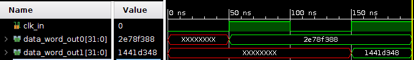
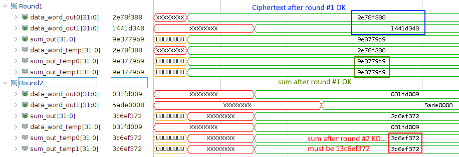

# Tiny Encryption Algorithm

Original paper: https://link.springer.com/content/pdf/10.1007/3-540-60590-8_29.pdf

- `tea.c`: reference implementation

```bash
 Original:  [ 3033477969 2215849402 ] [ 3730957404 1079459659 3148475311 4264830276 ]
 Encrypted: [ 10834573890804058552 18440013715259775776 ]
 Decrypted: [ 3033477969 2215849402 ]
```

- `tea-uint.c`:  `long` replaced by `uint32`

```bash
 Original:  [ B4CF3351 84132DBA ] [ DE61E45C 40573F4B BBA9EBAF FE342544 ]
 Encrypted: [ C41FD582 2CEAE40B ]
 Decrypted: [ B4CF3351 84132DBA ]
```

## Hardware implementation - First round

```bash
$ ./tea-firstround 
Tiny Encryption Algorithm - First round
Data: [ B4CF3351 84132DBA ]
Key: [ DE61E45C 40573F4B BBA9EBAF FE342544 ]
Encrypted: [ 2E78F388 1441D348 ]
```



Hey, looks like the first round of the hardware implementation is compliant with the original C code :smile:

## Hardware implementation - Two round version
There are a few things to be aware of in the main loop:
```c
while(n-->0) {
  sum += delta;
  y += ((z<<4) + k[0]) ^ (z + sum) ^ ((z>>5) + k[1]);
  z += ((y<<4) + k[2]) ^ (y + sum) ^ ((y>>5) + k[3]);
}
```
- [x] Permutation of ciphered words between each round.
- [x] Accumulation of `sum`.

After some rework, we're close to the result:



- Ciphertext after round #1.
- Not after round #2... :cry:

The main reason is due to the `sum` variable:

```c
sum+=delta; // once for each round
			// delta=9e3779b9
```

- [x] Round #1: `sum=9e3779b9`
- [ ] Round #2: `sum` should be **1**3c6ef372 ! There's a problem with the carry as numbers are stored in 32-bit variables: sum keeps growing up to 37 bits after 32 rounds.
  A solution may be to store everything in 37-bit wide variables: sum as well as key and text words, `xor` operations will need this.