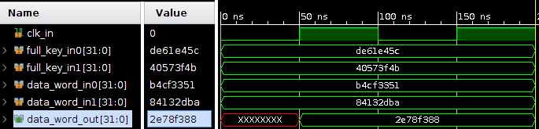

# Tiny Encryption Algorithm

Original paper: https://link.springer.com/content/pdf/10.1007/3-540-60590-8_29.pdf

- `tea.c`: reference implementation

```bash
 Original:  [ 3033477969 2215849402 ] [ 3730957404 1079459659 3148475311 4264830276 ]
 Encrypted: [ 10834573890804058552 18440013715259775776 ]
 Decrypted: [ 3033477969 2215849402 ]
```

- `tea-uint.c`:  `long` replaced by `uint32`

```bash
 Original:  [ B4CF3351 84132DBA ] [ DE61E45C 40573F4B BBA9EBAF FE342544 ]
 Encrypted: [ C41FD582 2CEAE40B ]
 Decrypted: [ B4CF3351 84132DBA ]
```

## Hardware implementation

```bash
$ ./tea-firstround 
Tiny Encryption Algorithm - First round
Data: [ B4CF3351 84132DBA ]
Key: [ DE61E45C 40573F4B BBA9EBAF FE342544 ]
Encrypted: [ 2E78F388 1441D348 ]
```



Hey, looks like the first round of the hardware implementation is compliant with the original C code :smile: