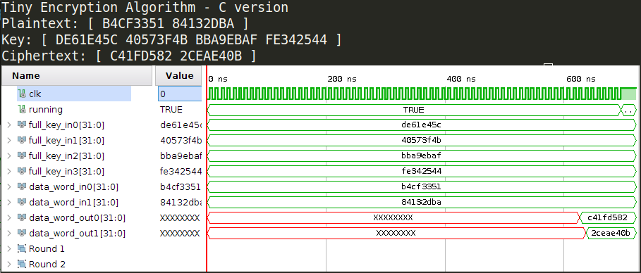
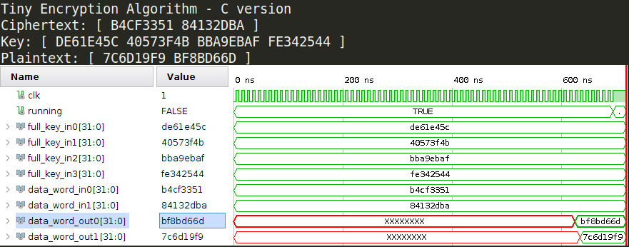
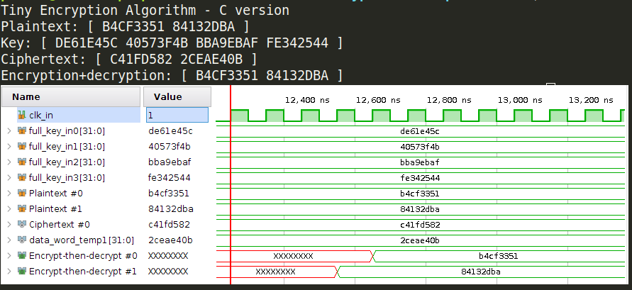

# Tiny Encryption Algorithm

Original paper: https://link.springer.com/content/pdf/10.1007/3-540-60590-8_29.pdf

- `tea.c`: reference implementation

```bash
 Original:  [ 3033477969 2215849402 ] [ 3730957404 1079459659 3148475311 4264830276 ]
 Encrypted: [ 10834573890804058552 18440013715259775776 ]
 Decrypted: [ 3033477969 2215849402 ]
```

- `tea-uint.c`:  `long` replaced by `uint32`

```bash
 Original:  [ B4CF3351 84132DBA ] [ DE61E45C 40573F4B BBA9EBAF FE342544 ]
 Encrypted: [ C41FD582 2CEAE40B ]
 Decrypted: [ B4CF3351 84132DBA ]
```

## Hardware implementation - 32-round version

The 32-round TEA encryption works as well as the C version :smile:



Now, we have the decryption core as well !



The encryption-then-decryption process works :wink:



## Synthesis results

> Target : Nexys4 DDR (xc7a100tcsg324-1)

| Site Type               | Used  | Fixed | Available | Util% |
| ----------------------- | ----- | ----- | --------- | ----- |
| Slice LUTs              | 16472 | 0     | 63400     | 25.98 |
| - LUT as Logic          | 16472 | 0     | 63400     | 25.98 |
| - LUT as Memory         | 0     | 0     | 19000     | 0.00  |
| Slice Registers         | 10290 | 0     | 126800    | 8.12  |
| - Register as Flip Flop | 10290 | 0     | 126800    | 8.12  |
| - Register as Latch     | 0     | 0     | 126800    | 0.00  |
## Todo list

- [x] Code cleaning
  - [x] Variable names
  - [x] Entity names
  - [x] Comments
- [x] Implementation results
- [ ] Comparison with other works : Hussain et al [[Hussain 2015]](https://ieeexplore.ieee.org/abstract/document/7421014) states that their sequential scheme takes 340 cycles (I get a bit less)

- However, their sequential core is really smaller in terms of area.
- **Needs some brainstorming to see where some LUTs/FFs can be saved.**